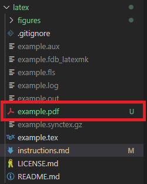

# Instructions for setting up LaTeX in VSCode
---
# 1. Download VSCode
- Link: https://code.visualstudio.com/download

# 2. Install LaTex Workshop from VSCode Extensions
- Your code in example.tex should now be colored (VSCode recognizes the language now)

# Just for kicks:
Try building the .tex file into a PDF to see if you can get this error...
- Open Tex: Ctrl-Alt-X
- While in the file example.tex, click Build LaTeX project
    - You should get this error: 

    

    - Close VSCode after receiving this error!

# 3. Download MiKTex for Windows
- Link: https://miktex.org/download
- Upon download completion, open up MiKTex Console:
    - Overview > Check for updates
    - Updates > Update Now
        - Upon completion of updates, a windows Terminal might appear on-screen: (If it does not, don't worry. Continue on.) 

            

# 4. Download Strawberry Perl
- Link: https://strawberryperl.com/
    - Download the 64-bit version
        - Keep it at location C:\Strawberry\

- About Perl: Strawberry Perl is designed to be as close as possible to perl environment on UNIX systems. See http://strawberryperl.com/

# 5. Re-open VSCode and attempt to build the .tex file
- Open up example.tex
- Build LaTeX Project: Ctrl-Alt-B
    - The first time you build, it has to install a bunch of packages, so it may take awhile!

        

# 6. View the PDF Version of the Compiled LaTeX document
- As you can see in the file explorer, our build has completed and there is now a .pdf file to view: 

    

- Right click on .pdf > Open to the Side

    

# 7. Re-build after making changes
- I have made a few changes. To see them reflected on the .pdf:
    
    - Save your file (Ctrl-S)

        - The .pdf should automatically build (you should see your changes immediately!)

## References
- Install LaTeX Workshop and compile PDF in VSCode LaTeX (Windows): https://www.youtube.com/watch?v=4lyHIQl4VM8